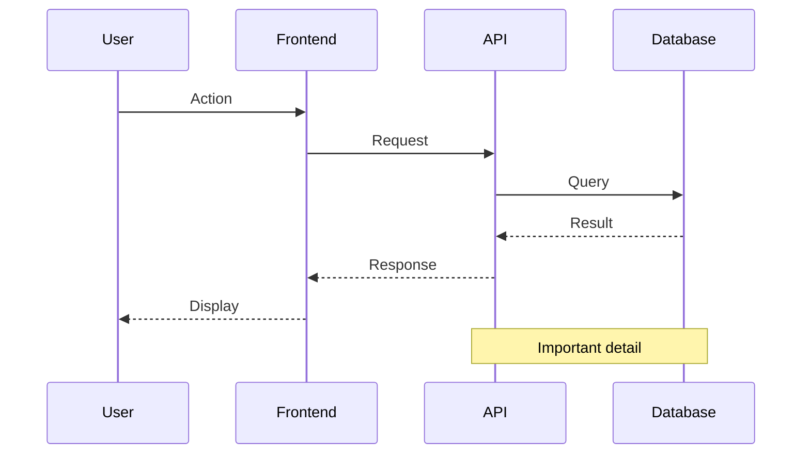
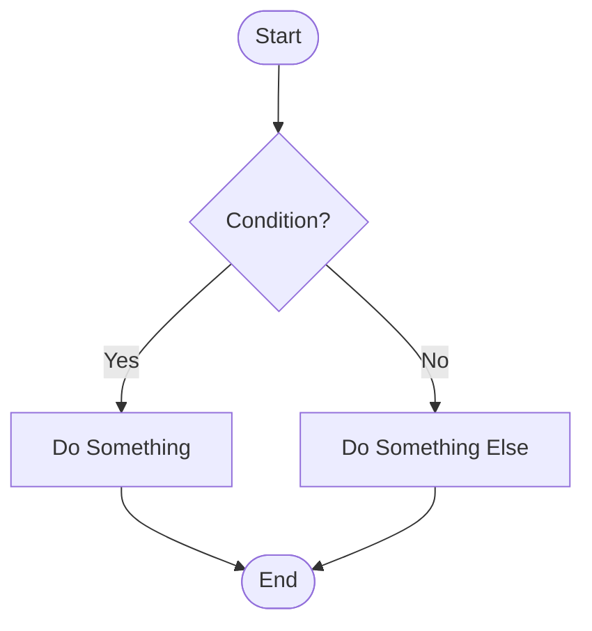

# Mermaid Diagram Generator

Generate interactive, shareable HTML diagrams using Mermaid.js to visualize system flows, sequences, architectures, and technical processes.

## When to Use This Skill

Activate this skill when:
- User asks to "create a diagram", "draw a diagram", "visualize this"
- User says "show me the flow", "how does X work", "what's the sequence"
- User wants to understand system architecture, database relationships, or process flows
- User needs to document workflows, API interactions, or state machines
- User says "turn this into a diagram", "make this visual"
- User is discussing complex interactions that would benefit from visualization

## Core Responsibilities

This skill creates **interactive HTML diagrams** that:

1. **Analyze the Context**: Understand what needs to be visualized (flows, sequences, relationships, states)
2. **Choose Diagram Type**: Select the most appropriate Mermaid diagram type
3. **Generate Mermaid Syntax**: Create accurate, well-structured Mermaid.js code
4. **Create HTML File**: Embed diagram in a standalone, shareable HTML file
5. **Add Documentation**: Include explanatory text, key points, and references

## Supported Diagram Types

### Sequence Diagrams
**Use for**: API calls, user flows, system interactions, webhook flows, authentication processes

**Example triggers**:
- "Show me how the team purchase flow works"
- "Diagram the authentication process"
- "What happens when a webhook fires?"

### Flowcharts
**Use for**: Decision trees, algorithms, process flows, state machines

**Example triggers**:
- "Draw the decision flow for user access"
- "Show the deployment process"
- "Visualize the error handling logic"

### Entity Relationship Diagrams
**Use for**: Database schemas, table relationships, data models

**Example triggers**:
- "Show the database structure"
- "Diagram the relationships between users, teams, and subscriptions"

### Class Diagrams
**Use for**: Object relationships, inheritance hierarchies, system architecture

**Example triggers**:
- "Show the class structure"
- "Diagram the component relationships"

### State Diagrams
**Use for**: State machines, status workflows, lifecycle processes

**Example triggers**:
- "Show the order status flow"
- "Diagram the subscription states"

### Gantt Charts
**Use for**: Project timelines, task scheduling, milestones

**Example triggers**:
- "Create a project timeline"
- "Show the release schedule"

## Instructions

### Step 1: Understand the Context

Ask clarifying questions if needed:
- What specific flow/process should be visualized?
- What level of detail is needed? (high-level overview vs detailed implementation)
- Are there specific components or actors that must be included?
- What's the output file name preference?

### Step 2: Gather Information

Use available tools to understand the system:

```bash
# Read relevant files to understand the flow
Read <file_path>

# Search for related code
Grep <pattern>

# Find related files
Glob <pattern>
```

**Important**: Base the diagram on actual code, not assumptions.

### Step 3: Choose Diagram Type

Select based on what's being visualized:

| What to Visualize | Diagram Type |
|-------------------|--------------|
| API calls, webhooks, async flows | Sequence Diagram |
| Decision logic, algorithms | Flowchart |
| Database tables, relationships | ER Diagram |
| Component architecture | Class Diagram |
| Status changes, workflows | State Diagram |
| Project timeline | Gantt Chart |

### Step 4: Create Mermaid Syntax

Write clear, well-structured Mermaid code:

**Sequence Diagram Template**:


**Flowchart Template**:


**See [diagram-examples.md](diagram-examples.md) for more templates.**

### Step 5: Generate HTML File

Create a standalone HTML file with:

```html
<!DOCTYPE html>
<html lang="en">
<head>
    <meta charset="UTF-8">
    <meta name="viewport" content="width=device-width, initial-scale=1.0">
    <title>Descriptive Title</title>
    <script src="https://cdn.jsdelivr.net/npm/mermaid@10/dist/mermaid.min.js"></script>
    <style>
        body {
            font-family: -apple-system, system-ui, sans-serif;
            max-width: 1400px;
            margin: 0 auto;
            padding: 20px;
            background: #f5f5f5;
        }
        h1 { color: #333; text-align: center; }
        .diagram-container {
            background: white;
            border-radius: 8px;
            padding: 30px;
            box-shadow: 0 2px 8px rgba(0,0,0,0.1);
        }
        .key-points {
            background: white;
            border-radius: 8px;
            padding: 20px;
            margin-top: 20px;
            box-shadow: 0 2px 8px rgba(0,0,0,0.1);
        }
    </style>
</head>
<body>
    <h1>Title</h1>
    <div class="diagram-container">
        <div class="mermaid">
            <!-- Mermaid diagram code here -->
        </div>
    </div>

    <div class="key-points">
        <h2>Key Points</h2>
        <!-- Explanatory content here -->
    </div>

    <script>
        mermaid.initialize({
            startOnLoad: true,
            theme: 'default'
        });
    </script>
</body>
</html>
```

### Step 6: Add Documentation

Include in the "Key Points" section:
1. **Phase breakdowns** (if applicable)
2. **Important details** about each step
3. **File paths** referenced in the diagram
4. **Why this design** (architectural decisions)
5. **Trade-offs** or considerations

### Step 7: Save and Confirm

**File naming convention**:
- Use descriptive, kebab-case names
- Example: `team-purchase-flow.html`, `auth-sequence.html`, `database-schema.html`

**Default location**: Project root or as specified by user

After creating:
1. Verify the HTML file was created successfully
2. Tell the user the file path
3. Mention they can open it in any browser
4. Summarize what the diagram shows

## Output Format

```
📊 Diagram created: /path/to/diagram-name.html

The diagram shows:
- [Brief description of what's visualized]
- [Number of actors/components/states]
- [Key phases or sections]

Open the file in your browser to view the interactive diagram.
```

## Best Practices

1. **Keep it Clear**: Don't overcrowd diagrams - break complex flows into multiple diagrams
2. **Use Phases**: For long sequences, use `Note over` to mark distinct phases
3. **Label Clearly**: Use descriptive participant names, not technical IDs
4. **Add Context**: Include notes for important decisions or state changes
5. **Style Consistently**: Use consistent arrow types, colors, and formatting
6. **Document Well**: The key points section should explain the diagram
7. **Real Data**: Base diagrams on actual code, not assumptions

## Common Patterns

### When user says "show me the flow for X"
1. Read relevant files to understand X
2. Choose sequence diagram for process flows
3. Break into phases (setup → action → result)
4. Generate HTML with phase annotations

### When user says "diagram the database"
1. Read schema files or migrations
2. Choose ER diagram
3. Show tables, columns, and relationships
4. Document key constraints

### When user says "visualize the architecture"
1. Read component files
2. Choose class diagram or flowchart
3. Show high-level components and their relationships
4. Document architectural decisions

## Mermaid Configuration

Use these settings for best results:

```javascript
mermaid.initialize({
    startOnLoad: true,
    theme: 'default',
    sequence: {
        diagramMarginX: 50,
        diagramMarginY: 10,
        actorMargin: 80,
        width: 200,
        height: 65,
        boxMargin: 10,
        messageMargin: 35,
        mirrorActors: true,
        useMaxWidth: true
    },
    flowchart: {
        useMaxWidth: true,
        htmlLabels: true,
        curve: 'basis'
    }
});
```

## Related Files

- [diagram-examples.md](diagram-examples.md) - Templates for each diagram type
- [mermaid-syntax-guide.md](mermaid-syntax-guide.md) - Complete Mermaid syntax reference
- [styling-guide.md](styling-guide.md) - HTML/CSS customization options

## Important Notes

- **Always use Read/Grep/Glob**: Base diagrams on actual code, not assumptions
- **Browser-ready**: HTML files should work standalone without setup
- **Mobile-friendly**: Use responsive design and readable fonts
- **Accessible**: Include alt text and semantic HTML
- **Shareable**: Files should be self-contained (no external dependencies except Mermaid CDN)
