# Diagram Examples

Complete templates for common diagram types using Mermaid.js.

## Sequence Diagram - API Flow

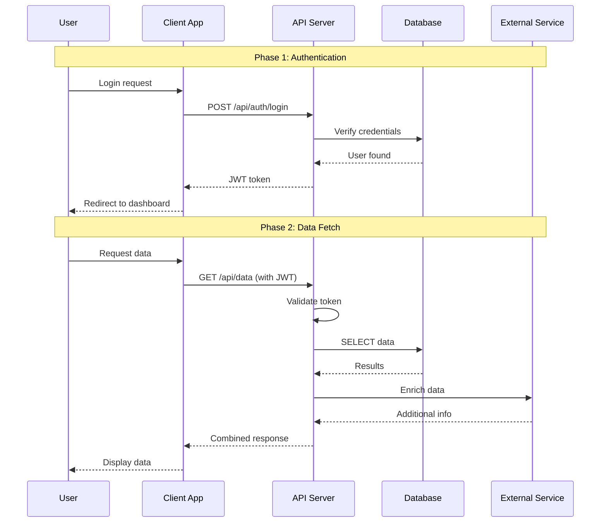

## Flowchart - Decision Logic

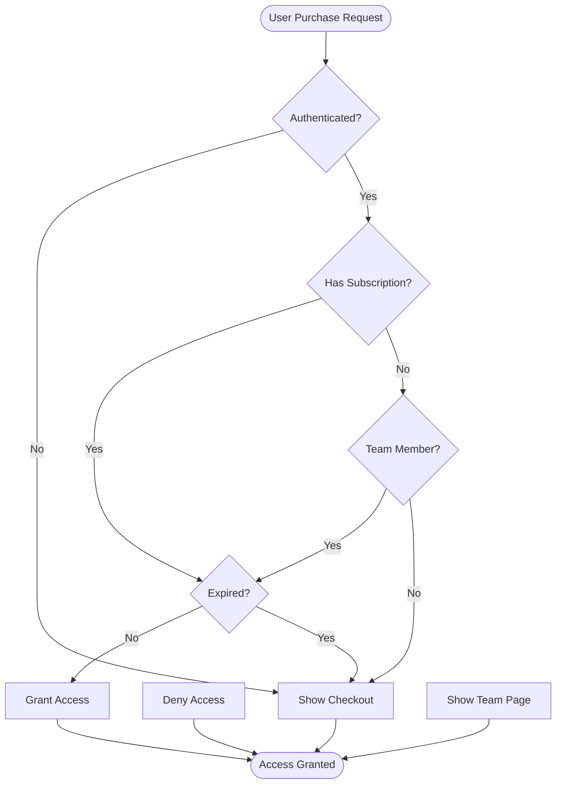

## Entity Relationship Diagram - Database Schema

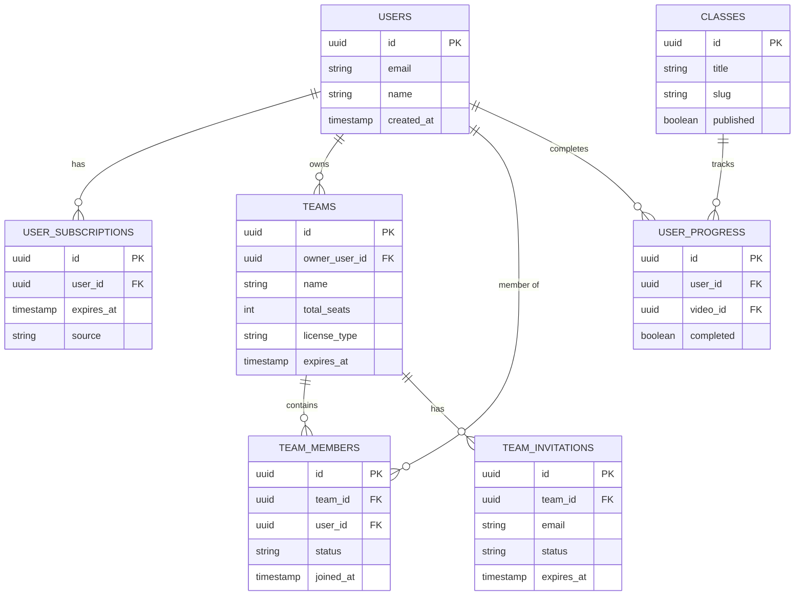

## State Diagram - Order Status

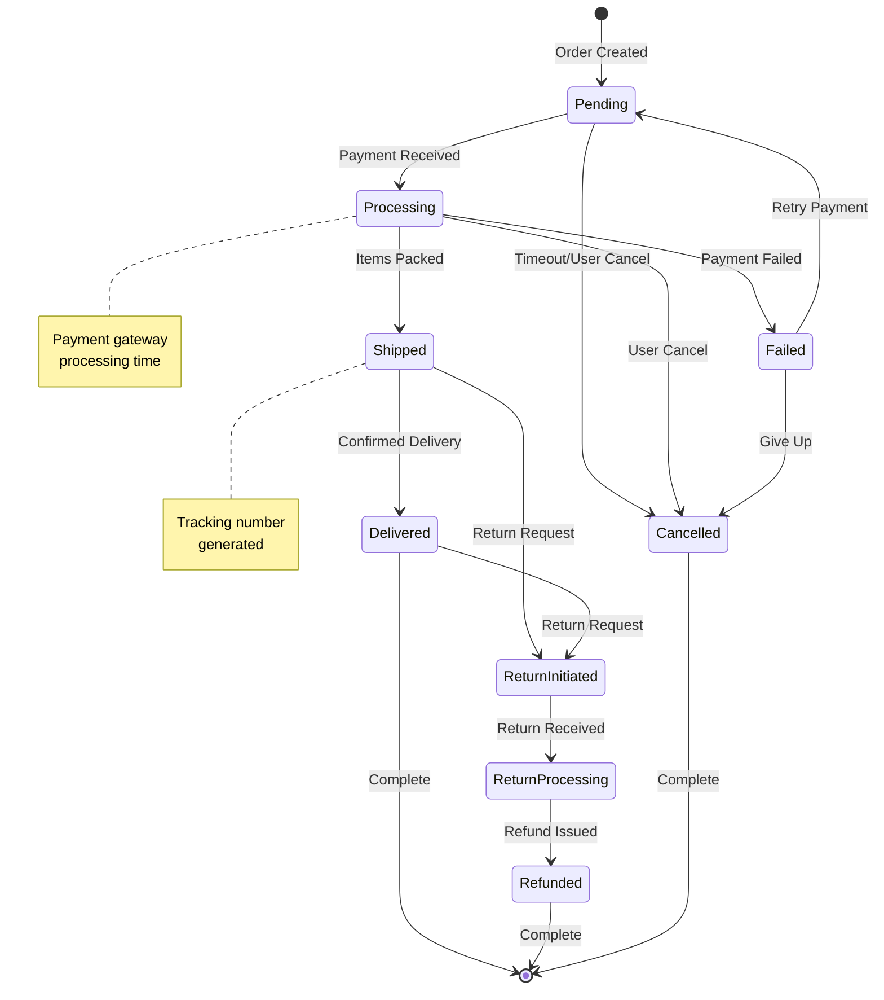

## Class Diagram - System Architecture

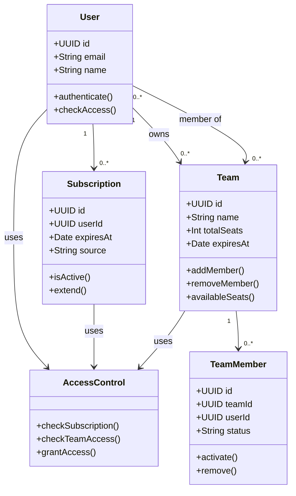

## Gantt Chart - Project Timeline

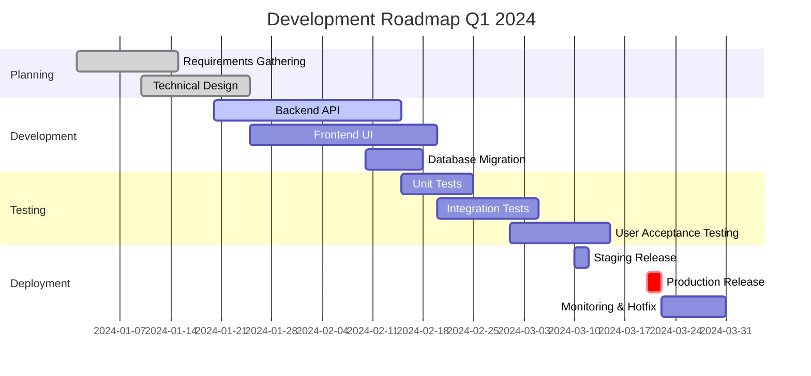

## Git Graph - Branch Strategy

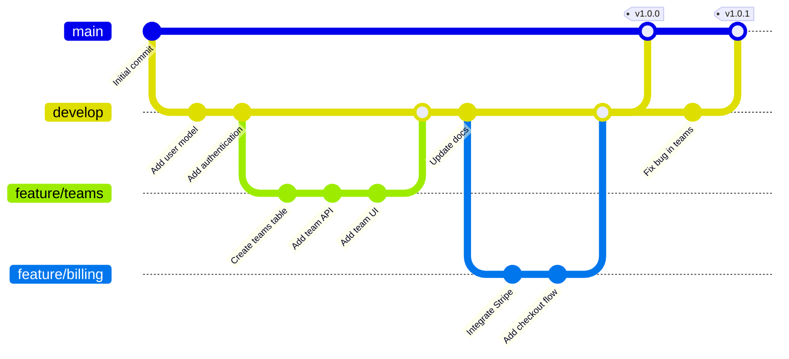

## Mindmap - Feature Planning

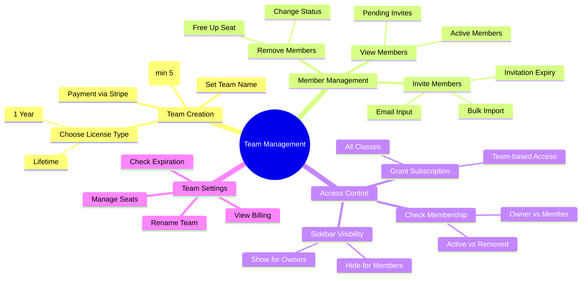

## Timeline - User Journey

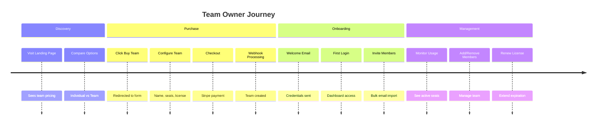

## Tips for Each Diagram Type

### Sequence Diagrams
- Use `Note over` to mark distinct phases
- Keep participant names short but clear
- Show return messages with `-->`
- Use `alt/else/opt/loop` for conditional flows

### Flowcharts
- Use consistent shapes: `[]` for process, `{}` for decision, `()` for start/end
- Keep text in nodes brief
- Avoid crossing lines when possible
- Use subgraphs for logical grouping

### ER Diagrams
- Show cardinality clearly: `||--o{` means one-to-many
- Include key columns but not all columns
- Document constraints in column descriptions
- Group related entities visually

### State Diagrams
- Start with `[*]` for initial state
- End with `[*]` for final state
- Use notes for important state information
- Keep transition labels concise

### Class Diagrams
- Show key attributes and methods only
- Use `+` for public, `-` for private
- Show inheritance with `--|>`
- Show associations with `-->`

### Gantt Charts
- Use clear section names
- Mark critical tasks with `:crit`
- Show dependencies between tasks
- Include milestones

## Advanced Features

### Styling Individual Elements

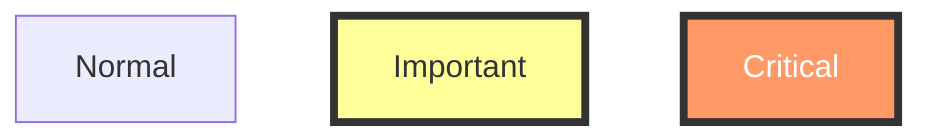

### Adding Links

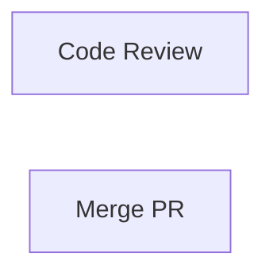

### Subgraphs

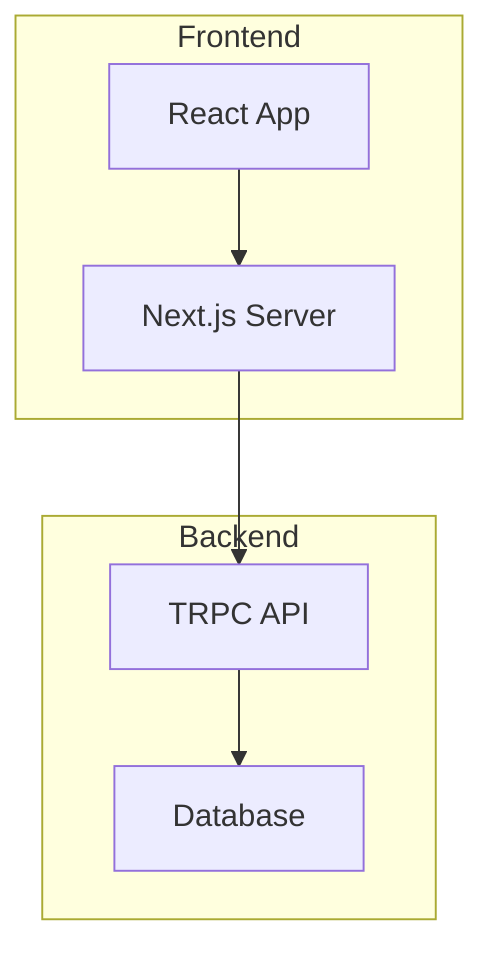
