# Mermaid Syntax Guide

Complete reference for Mermaid.js diagram syntax.

## Sequence Diagrams

### Basic Syntax

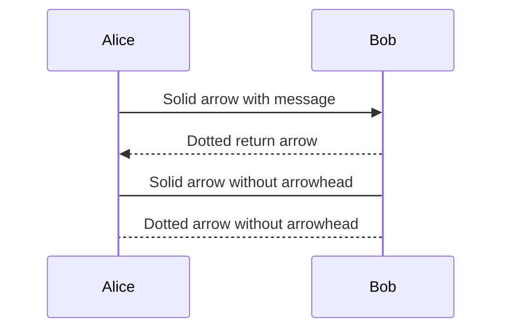

### Arrow Types

| Syntax | Description |
|--------|-------------|
| `->` | Solid line without arrow |
| `-->` | Dotted line without arrow |
| `->>` | Solid line with arrowhead |
| `-->>` | Dotted line with arrowhead |
| `-x` | Solid line with cross at end |
| `--x` | Dotted line with cross at end |
| `-)` | Solid line with open arrow |
| `--)` | Dotted line with open arrow |

### Activations

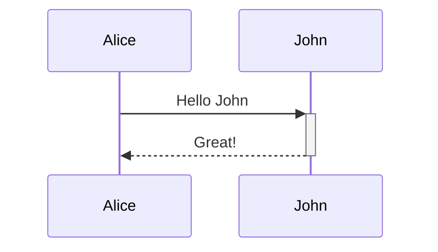

### Notes

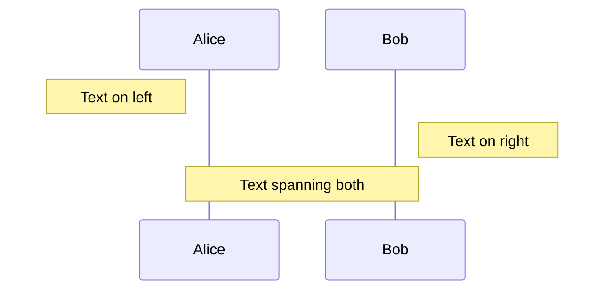

### Loops and Alternatives

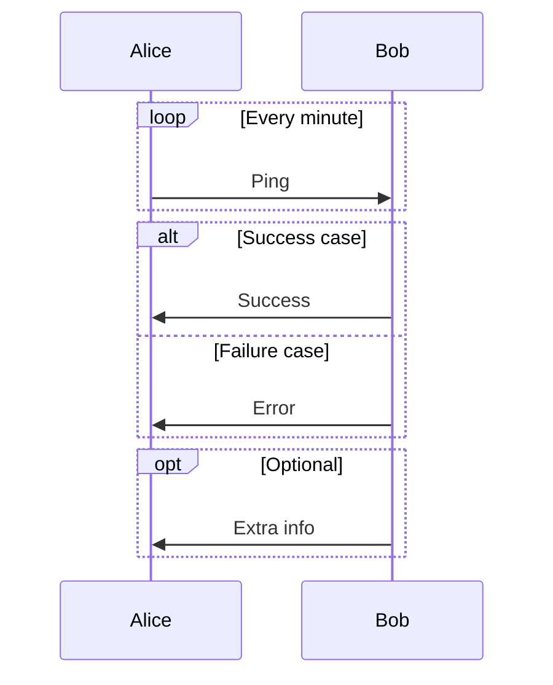

### Parallel Actions

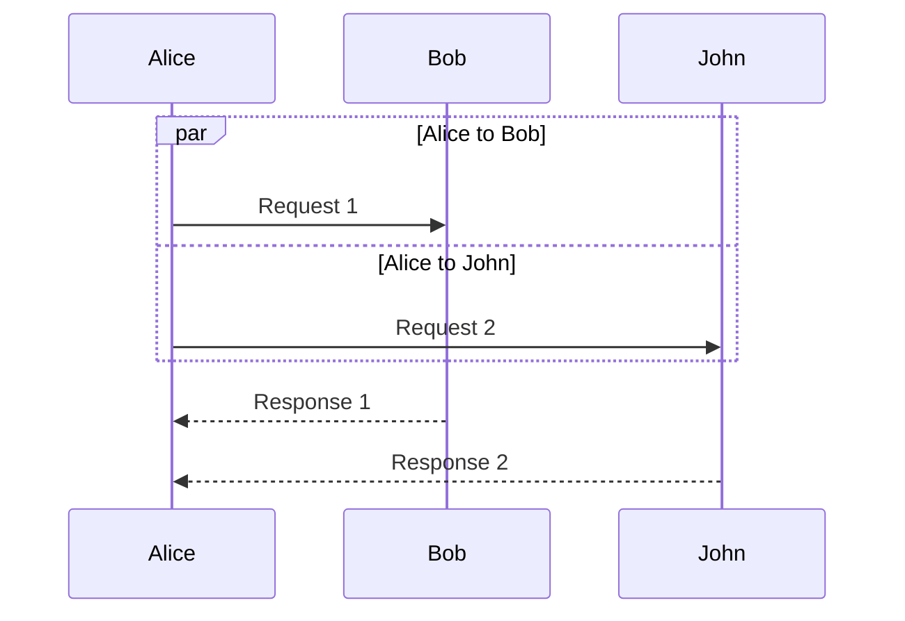

---

## Flowcharts

### Node Shapes

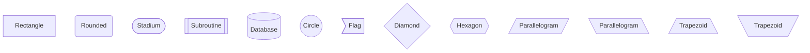

### Arrow Types

```mermaid
flowchart LR
    A --> B      %% Arrow
    B --- C      %% Line
    C -.-> D     %% Dotted
    D ==> E      %% Thick
    E ~~~ F      %% Invisible
```

### Arrow with Text

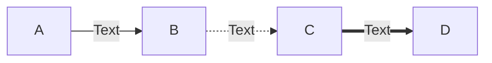

### Direction

```mermaid
flowchart TD   %% Top to Down
flowchart LR   %% Left to Right
flowchart BT   %% Bottom to Top
flowchart RL   %% Right to Left
```

### Subgraphs

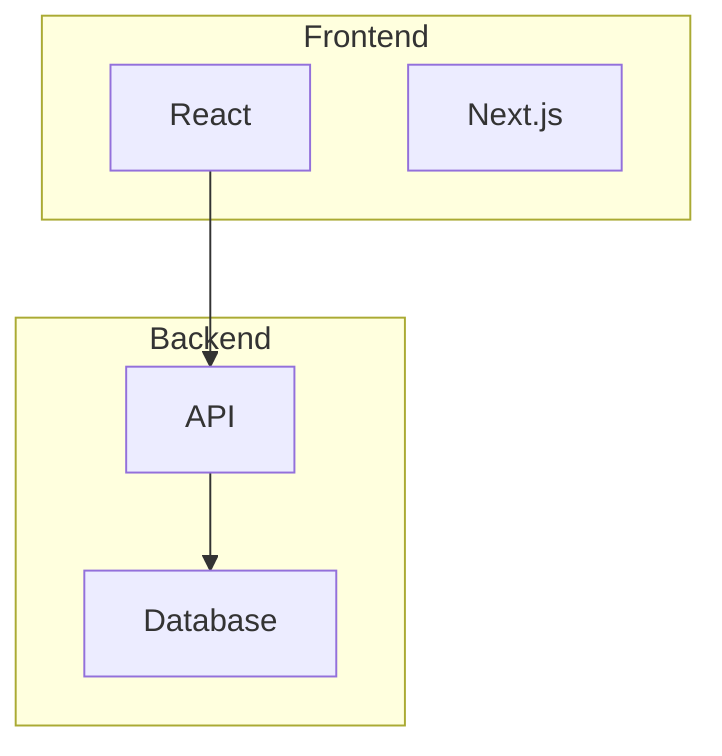

---

## Entity Relationship Diagrams

### Relationships

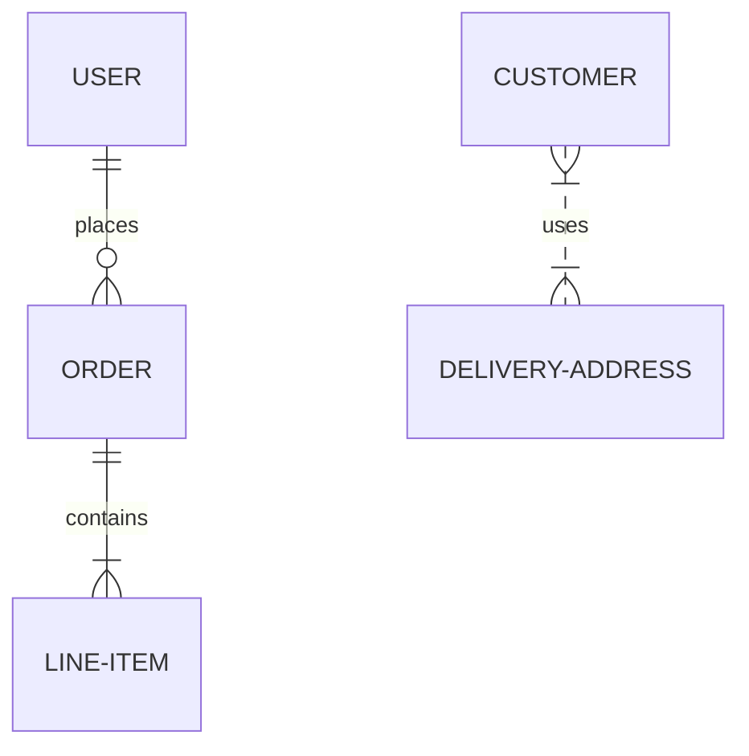

### Cardinality

| Value | Description |
|-------|-------------|
| `\|o` | Zero or one |
| `\|\|` | Exactly one |
| `}o` | Zero or many |
| `}\|` | One or many |

### Relationship Types

| Syntax | Description |
|--------|-------------|
| `--` | Non-identifying |
| `..` | Identifying |

### Attributes

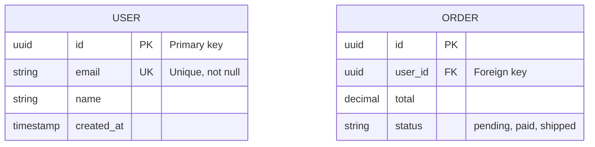

---

## State Diagrams

### Basic States

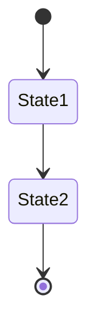

### Composite States

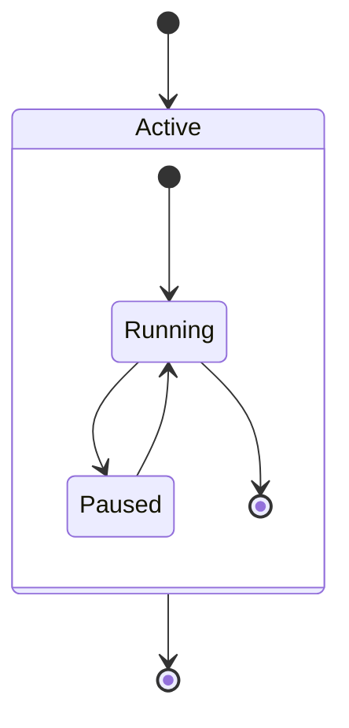

### Choice

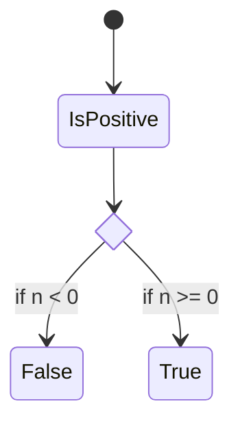

### Fork/Join

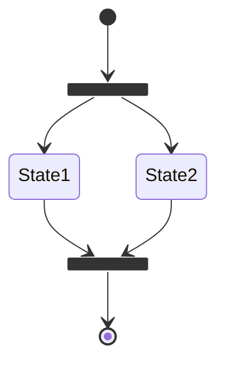

### Notes

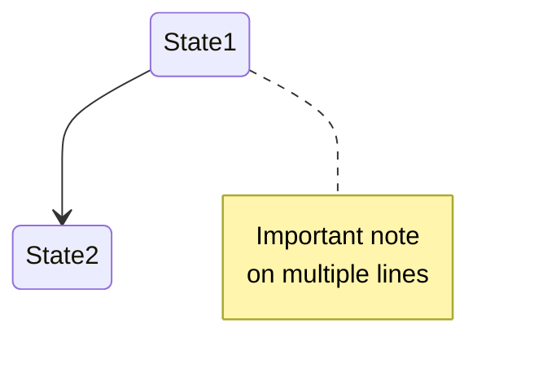

---

## Class Diagrams

### Basic Class

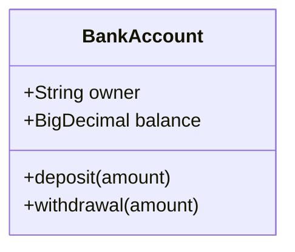

### Visibility

| Symbol | Visibility |
|--------|-----------|
| `+` | Public |
| `-` | Private |
| `#` | Protected |
| `~` | Package/Internal |

### Relationships

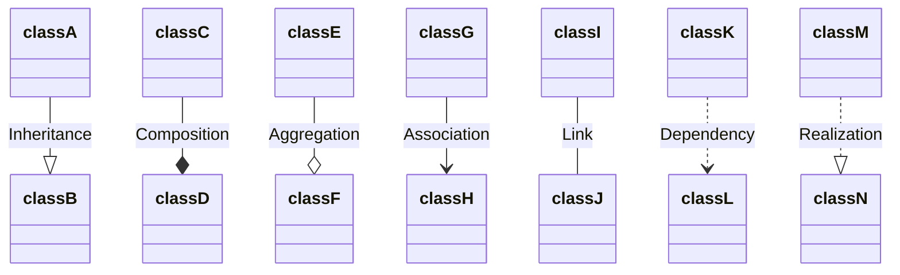

### Cardinality

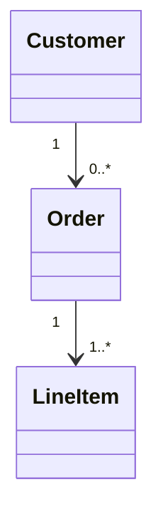

### Methods and Properties

```mermaid
classDiagram
    class User {
        +String email
        -String password
        #Date createdAt
        +authenticate() bool
        -hashPassword(String) String
    }
```

---

## Gantt Charts

### Basic Syntax

```mermaid
gantt
    title Project Schedule
    dateFormat YYYY-MM-DD

    section Planning
    Task 1           :a1, 2024-01-01, 30d
    Task 2           :after a1, 20d

    section Development
    Task 3           :2024-01-15, 45d
    Task 4           :2024-02-01, 30d
```

### Task Status

```mermaid
gantt
    dateFormat YYYY-MM-DD

    Completed task      :done, des1, 2024-01-01, 2024-01-08
    Active task         :active, des2, 2024-01-09, 3d
    Future task         :des3, after des2, 5d
    Critical task       :crit, des4, 2024-01-15, 2024-01-20
    Critical & Active   :crit, active, des5, 2024-01-18, 5d
```

---

## Git Graph

### Basic Commits

```mermaid
gitGraph
    commit
    commit
    commit
```

### Branches

```mermaid
gitGraph
    commit
    branch develop
    checkout develop
    commit
    commit
    checkout main
    merge develop
```

### Tags

```mermaid
gitGraph
    commit
    commit tag: "v1.0.0"
    branch develop
    commit
    checkout main
    merge develop tag: "v1.1.0"
```

---

## Pie Charts

```mermaid
pie title Pets adopted by volunteers
    "Dogs" : 386
    "Cats" : 85
    "Rats" : 15
```

---

## Mindmaps

```mermaid
mindmap
  root((Project))
    Planning
      Requirements
      Design
    Development
      Frontend
      Backend
    Testing
      Unit Tests
      Integration Tests
```

---

## Timeline

```mermaid
timeline
    title History of Social Media
    2002 : LinkedIn
    2004 : Facebook
         : Google
    2005 : Youtube
    2006 : Twitter
```

---

## Styling

### Inline Styles

```mermaid
flowchart LR
    A[Default]
    B[Styled]

    style B fill:#f9f,stroke:#333,stroke-width:4px
```

### Style Classes

```mermaid
flowchart LR
    A[Node 1]:::someclass
    B[Node 2]:::anotherclass

    classDef someclass fill:#f96,stroke:#333
    classDef anotherclass fill:#bbf,stroke:#333
```

### Theme Configuration

```javascript
mermaid.initialize({
    theme: 'default',        // or 'dark', 'forest', 'neutral'
    themeVariables: {
        primaryColor: '#ff0000',
        primaryTextColor: '#fff',
        primaryBorderColor: '#333',
        lineColor: '#666',
        secondaryColor: '#00ff00',
        tertiaryColor: '#0000ff'
    }
});
```

---

## Comments

```mermaid
%% This is a comment
flowchart LR
    A[Node] %% Comment on same line
```

---

## Special Characters

To use special characters in text, wrap in quotes:

```mermaid
flowchart LR
    A["Text with (parentheses)"]
    B["Text with {braces}"]
    C["Text with [brackets]"]
```

---

## Line Breaks

Use `<br/>` for line breaks in node text:

```mermaid
flowchart LR
    A["First line<br/>Second line<br/>Third line"]
```

---

## Configuration Options

### Sequence Diagrams

```javascript
{
    sequence: {
        diagramMarginX: 50,
        diagramMarginY: 10,
        actorMargin: 80,
        width: 200,
        height: 65,
        boxMargin: 10,
        boxTextMargin: 5,
        noteMargin: 10,
        messageMargin: 35,
        mirrorActors: true,
        bottomMarginAdj: 1,
        useMaxWidth: true,
        rightAngles: false,
        showSequenceNumbers: false
    }
}
```

### Flowcharts

```javascript
{
    flowchart: {
        useMaxWidth: true,
        htmlLabels: true,
        curve: 'basis',     // or 'linear', 'step', 'stepBefore', 'stepAfter'
        diagramPadding: 8,
        nodeSpacing: 50,
        rankSpacing: 50
    }
}
```

### Gantt Charts

```javascript
{
    gantt: {
        titleTopMargin: 25,
        barHeight: 20,
        barGap: 4,
        topPadding: 50,
        leftPadding: 75,
        gridLineStartPadding: 35,
        fontSize: 11,
        numberSectionStyles: 4,
        axisFormat: '%Y-%m-%d'
    }
}
```

---

## Best Practices

1. **Keep it Simple**: Don't overcrowd diagrams
2. **Use Descriptive Labels**: Make text clear and concise
3. **Consistent Naming**: Use consistent participant/node names
4. **Add Notes**: Explain complex transitions
5. **Group Logically**: Use subgraphs and sections
6. **Test Rendering**: Some complex diagrams may need simplification
7. **Use Comments**: Document your diagram structure

---

## Common Issues

### Text Too Long
Break into multiple lines or use abbreviations:
```mermaid
flowchart LR
    A["This is a very long<br/>text that spans<br/>multiple lines"]
```

### Overlapping Connections
Adjust node positions or use invisible links:
```mermaid
flowchart LR
    A ~~~ B  %% Invisible link to position nodes
```

### Special Characters
Always quote strings with special characters:
```mermaid
flowchart LR
    A["User's Input"]
    B["Error: (404) Not Found"]
```

---

## Resources

- [Official Mermaid Documentation](https://mermaid.js.org/)
- [Mermaid Live Editor](https://mermaid.live/)
- [GitHub Mermaid Support](https://github.blog/2022-02-14-include-diagrams-markdown-files-mermaid/)
